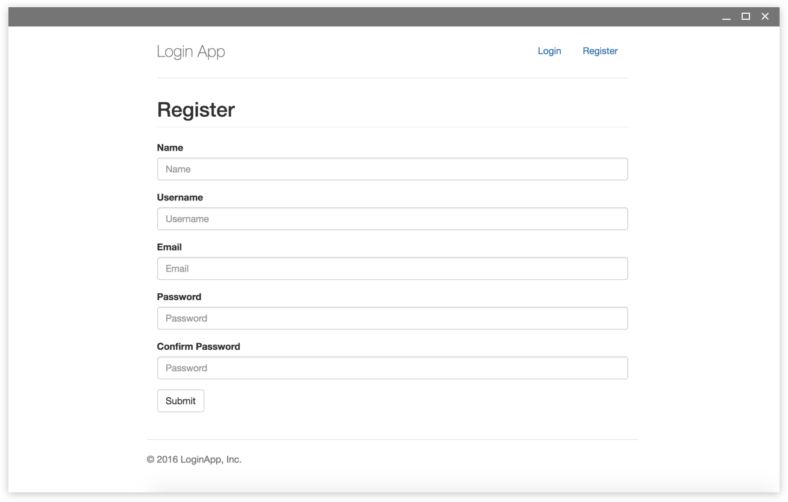
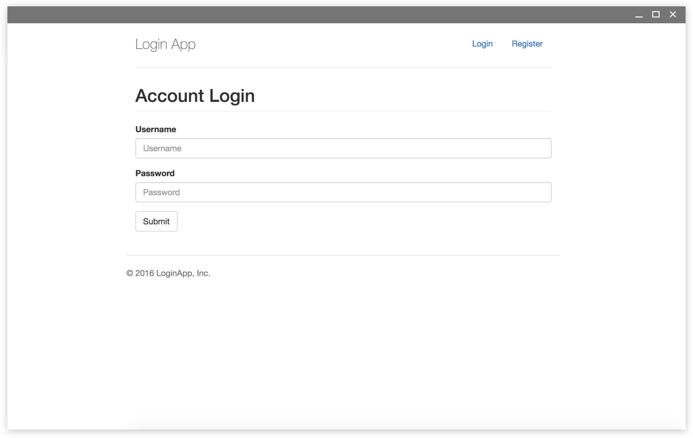

# Login App

[](https://travis-ci.org/ryanbozarth/login-app)

https://node-login-app.herokuapp.com/

## Introduction
This app provides you the ability to register a new user, login as an authenticated user, and logout. The login experience is a placeholder dashboard - this code is intended to provide you a simple user authentication for your own app. It uses handlebars, bcrypt, passport, with MongoDB and Node on the backend.

Trust, but verify.





## Documentation

If you would like to try running it yourself:

```
$ mongod
$ node server.js
```

## Packages and Other Technology Used

- Javascript
- Node / Express
- MongoDB / Mongoose
- Mocha / Chai
- Bcrypt
- Passport
- Handlebars
- Travis
